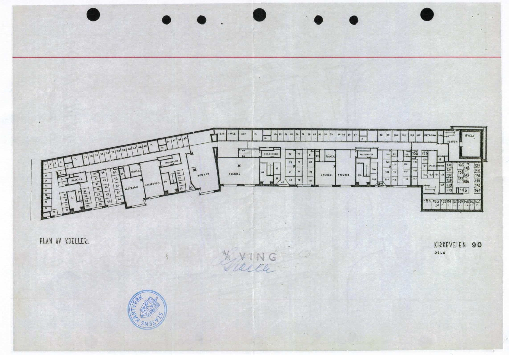
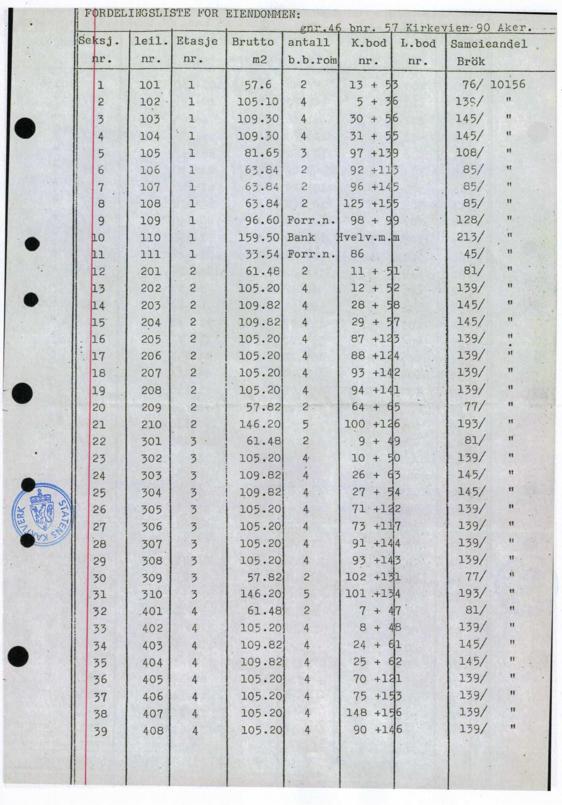
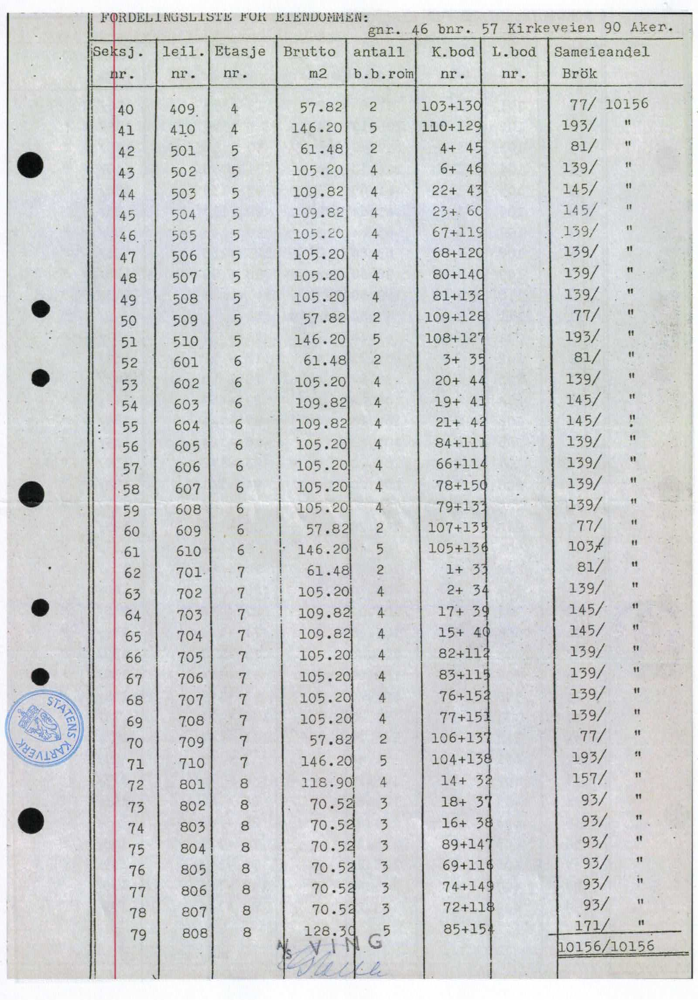

# Boder
{: .no_toc }

  
Innhold

  {: .text-delta }
1. TOC
{:toc}

Hver sameierseksjon har én (de minste) eller to tinglyste boder. Det har hendt at folk har byttet seg imellom, brukt feil boder, etc. og det ble derfor i 2022 gjort et stort arbeide av daværende styreleder Anne Steen for å kartlegge og ordne opp i situasjonen. På dette tidspunktet ble alle bodene merket (med små, hvite lapper) hvilken leilighet tilhører: "E\|4V", "C\|1H", etc

Disse hvite lappene er fasiten og er basert på den opprinnelige seksjoneringsbegjæringen av 1974. Styret ønsker å bytte dem med [noe mer holdbart](https://www.foldal.no/sm%C3%A5-merkeskilt-i-plast) når tiden tillater det. Skulle boden mangle en lapp så kan man referere til kjellerplanen og seksjonstabellen på bunnen av siden.

Merk! Numrene på dørene har ingenting med dette å gjøre - vil du vite hvorfor kan du fortsette å lese.

## Historie

Fram til 1974 var sameiet eid av Helle-familien og bestod av utleieleiligheter. Eiendommen ble nå seksjonert og leilighetene gjort om til selveierseksjoner. I denne sammenhengen ble det laget en oversikt over bodene, disse ble gitt nummer (som ikke samsvarer på hva-enn som måtte stå på boddøra) og tildelt seksjonene.

Kjellerplanen lenger ned på siden viser hvilke boder som har hvilke nummer. Disse numrene i planen har _ingenting_ med hvilke nummer som måtte stå på døra! Det er kjempeforvirrende. Noen dører har forskjellige nummer både i rødt og blått. Bare glem disse! Det er seksjoneringen av 1974, med nummereringen som er innsendt, som bestemmer hvilke boder man har rett til å benytte. Den påmalte nummereringen på bodene er fra en annen tid.

### Ikke eiendomsrett!
Det som følger er utdrag fra en epost sendt av tidligere forretningsfører for gården, Dag Erlandsen, 29. september 2022:

> Selv om det i seksjoneringsbegjæringen er angitt hvilke boder som hører til de enkelte
seksjoner, er ikke bodene registrert som tilleggsareal til seksjonene. Derfor gir ikke
grunnboken for de enkelte seksjoner opplysninger om hvilke boder man har rett til. Da
Kirkeveien 90 ble seksjonert, var det ikke adgang til å la de enkelte seksjoner omfatte
tilleggsdeler som ikke lå inntil seksjonen. Konsekvenser er at bodene utgjør et
fellesareal, og seksjonene har kun en bruksrett og ikke en eiendomsrett til bodene.

## Bilder

### Kjellerplan
Planen viser hvilke boder som har hvilke nummer. Disse numrene har _ingenting_ med hvilke nummer som måtte stå på døra! Det er kjempeforvirrende. Noen dører har (tildels forskjellige) nummer både i rødt og blått. Bare glem det. Det er seksjoneringen av 1974 som bestemmer hvilke boder man har rett til å benytte.

<figure>

<figcaption>Kjellerplan</figcaption>
</figure>

### Fordelingsliste 
Her er listene som ble sendt inn i 1974 som viser koblingen mellom seksjon og boder. Ønsker du å se hvor disse bildene kommer fra kan du be om saksinnsyn i saken lenket i bunn av siden - eventuelt bare se på pdf-en som vi har liggende på denne siden ;)

<figure>

</figure>

## Dokumenter
- [Seksjoneringsbegjæring fra 1974][begjæring-1974]
- [Innsyn][sak-197403225]

[sak-197403225]: https://innsyn.pbe.oslo.kommune.no/saksinnsyn/casedet.asp?mode=&caseno=197403225
[begjæring-1974]: ./Seksjoneringsbegjæring 19740522.PDF
